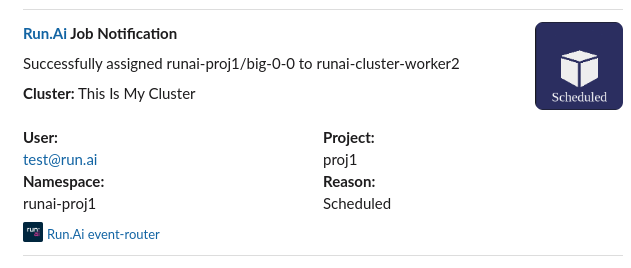

# Run.Ai event-router 
This repo is a wrapper chart of [kubernetes-event-exporter](https://github.com/resmoio/kubernetes-event-exporter) open source project configured specifically to trigger alerts from Run.Ai cluster. 

> **Note**: Event router currently is configured out of the box only for parsing Run.ai scheduler events to slack

## Configure slack notifications

### Configuring the slack app
The slack app is used to trigger notifications to a channel and to generate auth token to the event-router.
You can create a new slack app [here](https://api.slack.com/apps).

After pressing on the create new app button, you should have the option to create the app from an `app manifest`.
Copy the following slack manifest definition in order to create `runai-event-router-app`:
```yaml
display_information:
  name: runai-event-router
  description: This app is used by runai-event-router for sending notifications through slack
  background_color: "#141f40"
features:
  bot_user:
    display_name: runai-event-router-app
    always_online: false
oauth_config:
  scopes:
    bot:
      - chat:write
      - incoming-webhook
      - chat:write.public
settings:
  org_deploy_enabled: false
  socket_mode_enabled: false
  token_rotation_enabled: false

```

After creating your app go to the "**OAuth & Permissions**" section in your app and grab the `Bot User OAuth Token`, in the following step paste the token in the values.yaml.

> **Note** In order to create the slack app without a manifest you can follow slack docs: [guide to creating Slack apps with bot tokens](https://api.slack.com/authentication/basics). 

### Clone the repository and edit the `values.yaml` file
```yaml
runaiProjects: 
  - my_runai_project

clusterName: ""

slack:
  enabled: true
  apiToken: ""
  channel: ""
```

`runaiProjects` - Projects listed here will set notifications, regex pattern is supported `.*` will grep all etc'...

`clusterName` - Identifier for the cluster to show in the notifications

**slack**

`enabled` - Enable slack integration

`apiToken` - Slack bot token, configured with '**chat:write**'
permissions. (see previous section)


`channel` - A destination channel **'runai-notifications'** a direct message '**@bob.marly**' or dynamic by setting '**pod-project**'.

> If the value of `channel` is set to pod-project, the event router will try to send the notification by tagging '**@project**' where project is taken from the 'project' label attached to your pod by runai.

### Deploy the chart
After configuring the values file you can run the following commands in order to deploy the chart:
```sh
chmod +x post-process.sh
helm install runai-event-router . -n runai-monitoring --create-namespace --post-renderer ./post-process.sh
``` 

### Checkout your channel


